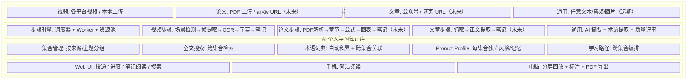

# 00 · 项目愿景

> 项目**为什么存在**，以及**不做什么**。做决策时用它来回答"这事该不该做"。

## 一句话

AI 辅助的个人学习知识库——把视频、论文、文章等学习材料，自动转化为结构化笔记，积累为可检索、可关联的个人知识体系。

## 1. 目标

### 1.1 功能目标（做什么）

- **多来源内容摄入**：B站视频、YouTube视频、本地视频、论文PDF、微信公众号文章、网页文章
- **自动分析生成笔记**：截图+逐字稿（机械版）+ AI 结构化重组（智能版）
- **个人知识库**：按来源/主题分集合，跨集合搜索，术语词典，学习路径
- **手机投递+阅读**：粘贴 URL 即投递，手机上阅读笔记，电脑上精确回放+标注
- **AI 辅助学习**：术语解释、概念关联、知识问答（基于已积累的笔记）

### 1.2 工程目标（怎么做）

- **可扩展**：新增内容类型（论文/文章）只需写适配器+步骤，不改框架
- **自托管**：Docker 部署，不依赖第三方平台，数据完全自有
- **低成本**：Claude 订阅 + 现有硬件 + 可选云服务器
- **AI 主力开发**：Claude 作为主力协作者，人做架构和验收
- **渐进式**：先做视频，验证通了再加论文/文章，不一步到位

### 1.3 非功能目标

- 笔记质量 ≥ 4/5（AI 评审）
- 手机投递到笔记可读 < 30 分钟（短视频）
- 知识库搜索 < 1 秒
- 宿主机零污染（全 Docker）

## 2. 非目标（明确不做）

| 非目标 | 原因 |
|--------|------|
| 多用户/社交 | 个人工具，不对外 |
| 实时转写/直播分析 | 离线处理已足够 |
| 笔记编辑器 | 只做标注，不做 Notion/Obsidian |
| 知识图谱可视化（M1 不做） | M1 用术语词典+搜索即可；概念关联/网络化是 ROADMAP M2.5 的**规划项，尚未实现**（无代码） |
| 移动端原生 App（M1 不做） | M1 用浏览器 PWA 即可；原生 iOS/Mac App 是 ROADMAP M3 的**规划项，尚未实现**（无代码） |
| 多语言界面 | 中文为主，英文内容用中文笔记 |

> **关于"未来"能力的口径**：本文档"做什么"一节里描述的部分能力（语义检索 / 与知识库对话等 RAG 交互 = M2.5，原生客户端 / 视频回放 / 标注 = M3，闪卡 / 间隔重复 / 矛盾检测等学习回路 = M4）是**已规划但尚未构建**的里程碑，当前代码库中没有对应实现。已落地的范围（视频/论文/文章/播客四类摄入、领域概念图、集合订阅、FTS5 搜索、术语库）以 [ROADMAP.md](../ROADMAP.md) 标记 ✅ 的里程碑为准——切勿据本文档推断这些未来能力已存在。

## 3. 用户画面

### 场景一：手机刷到好视频
> 在视频网站看到一个讲解视频 → 复制 URL → 打开知识库网页粘贴投递 → 继续刷视频 → 半小时后收到通知"笔记已生成" → 打开阅读，关键截图+结构化要点一目了然

### 场景二：系统学习某个主题
> 想学某个技术 → 创建集合 → 批量导入一个播放列表 → 过夜处理 → 第二天有几十份结构化笔记 → 按学习路径依次阅读 → 遇到不懂的术语点击查看词典解释

### 场景三：电脑深度学习
> 打开某个笔记 → 左边读笔记右边看视频 → 点击时间戳跳转到对应片段 → 标注重点和疑问 → 搜索"这个概念在其他视频里怎么讲的" → 跨集合找到关联内容

### 场景四：阅读论文
> 拖拽 PDF 上传 → 自动提取章节/公式/图表 → 生成中文摘要笔记 → 关联已有的视频笔记中提到的相关概念

## 4. 系统边界

