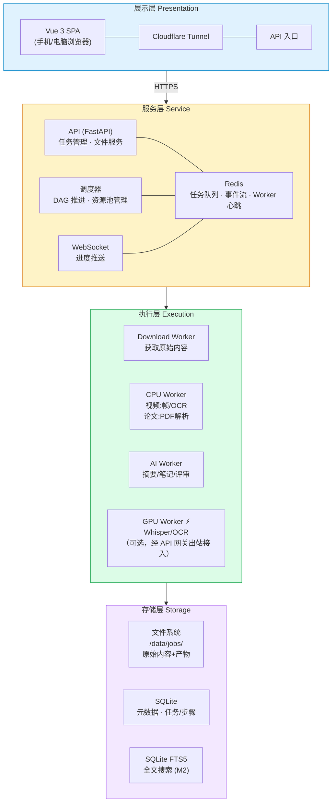
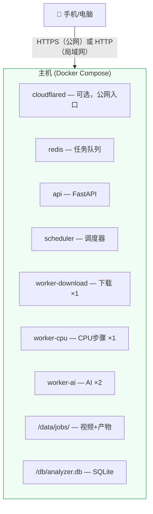
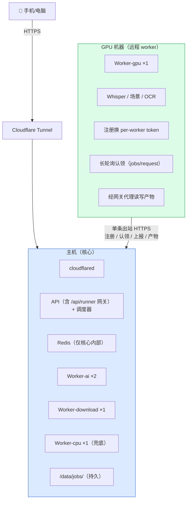
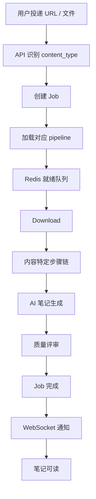
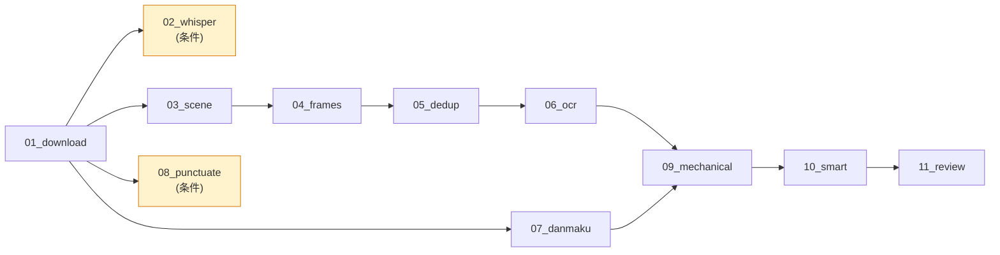
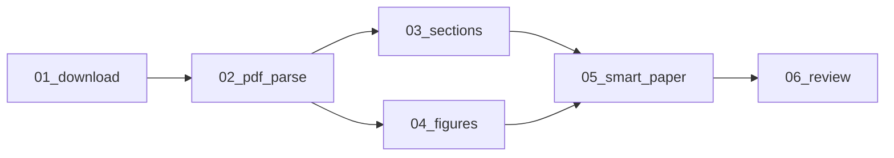
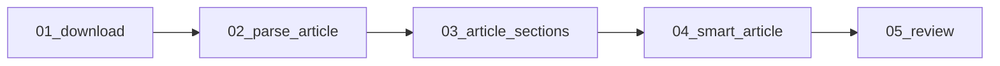
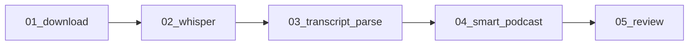
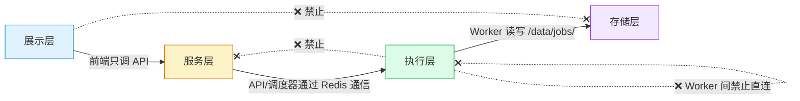

# 01 · 系统架构

> 系统全景图。读完这个文档，你就知道系统由哪些组件构成、怎么通信、怎么部署。

## 1. 一句话

主机跑全部核心服务，Cloudflare Tunnel 做用户公网入口，远程 worker 经单条出站 HTTPS 接入 API 网关（不开入站端口、不连中心 Redis/MinIO）。

## 2. 组件分层

## 3. 部署拓扑

两种推荐架构，应用逻辑完全相同，区别只在 StorageBackend 和网络配置。**先在单机完成全部开发和测试，再拆分到多机**。

### 架构一：All-in-One（推荐起步）

一台机器，一个 docker-compose，全部服务。自托管服务器、PC、云服务器均可。

局域网直接访问 `http://主机IP:3000`，公网加 Cloudflare Tunnel。

**开发和测试全部在此模式完成**。所有 Worker 用 `LocalStorage`（直接读写 /data/jobs/），无 MinIO。

### 架构二：分层部署（核心 + 远程 Worker，经 API 网关接入）

有独立 GPU 机器或多台 Worker 机器时，远程 worker 经 API 上的 `/api/runner/*` 网关单条出站 HTTPS 接入核心，不连中心 Redis/MinIO（见 [ADR-0009](adr/0009-worker-gateway-outbound-https.md)）：

远程 worker 用 `GatewayStorage`（产物经 `/api/runner/jobs/{id}/artifacts` 代理读写），核心 worker 用 `LocalStorage`。worker 仅需出站 HTTPS 到 API，中心 Redis/MinIO 不对 worker 暴露。

**两条独立通信线路**：

| 线路 | 路径 | 用途 | worker 被攻破影响 |
|------|------|------|------------------|
| 用户访问 | 用户 → Cloudflare → 核心 | Web UI + API | 与 worker 接入正交 |
| Worker 接入 | 远程 worker → HTTPS → API `/api/runner/*` | 注册 + 认领 + 上报 + 产物代理 | per-worker token 可吊销；产物经网关，中心 Redis/MinIO 不暴露 |

### 从 All-in-One 到分层：worker 端只改环境变量

worker 进程按环境变量自适应三种模式（见 `worker/main.py`）：

| 模式 | 环境变量 | Redis/DB | 存储 | 认领 |
|------|---------|----------|------|------|
| 本地 / 单机 | 不设 `GATEWAY_URL` | 直连 | LocalStorage | RedisTransport |
| 混合 | `GATEWAY_URL` + `REDIS_URL` 都设 | 作内层兜底 | GatewayStorage | 走网关，redis 镜像 |
| 纯网关（真零隧道） | 仅设 `GATEWAY_URL` | 不连 | GatewayStorage | 全走网关 |

纯网关模式下 worker 持接入 token 调 `POST /api/runner/register` 换 per-worker token，再长轮询 `POST /api/runner/jobs/request` 认领、`/complete`·`/fail` 上报、经 `artifacts` 端点拉取输入/回传产物，全程单条出站 HTTPS。

**多机额外测试项**（单机测完后仅需验证）：

| 测试项 | 内容 |
|--------|------|
| 网关认领回路 | 远程 worker 注册→认领→上报闭环 |
| 产物代理 | 大文件（1GB+视频）经网关 pull/push 完整性 |
| 网络延迟下的心跳 | worker 心跳在高延迟下不误判为离线 |

这些是基础设施测试，不涉及应用逻辑。

## 4. 数据流

### 通用处理模型

所有内容类型共享同一个处理框架，只是步骤链（pipeline）不同：

### 各内容类型的步骤链

调度器从 `pipelines.yaml`（GitLab-CI 风格：`extends`/`variables`/`needs`/`rules`）加载对应 content_type 的步骤 DAG——执行顺序由 `needs` 推导，条件跳过/开关由 `rules`（如 `exists` 匹配输入文件）决定。步骤键在每条 pipeline 内各自从 `01` 递增，跨 pipeline 不共享编号空间：

**视频 (video)** — M1 实现：

**论文 (paper)** — M1 实现：

**文章 (article)** — M6 实现：

**音频 / 播客 (audio)** — M6 实现：

每种类型共享 `01_download`（下载/获取原始内容）和 `*_smart` / `*_review`（AI 笔记 + 评审）的模式，中间的处理步骤按内容类型各异。audio 复用 video 的 whisper 步做转写（落在 gpu 池，含 cpu fallback）。

### 视频步骤 DAG 详解

无依赖的步骤并行执行。`09_mechanical` 等待 `06_ocr` + `07_danmaku` 汇合（机械版优先用 `08_punctuate` 标点稿，没有则直接读原始字幕，故不硬依赖 AI 步）。

## 5. 资源池模型

步骤映射到资源池，资源池限制并发。池与内容类型无关——不同类型的步骤可以共享同一个池：

> 步骤编号在每条 pipeline 内独立，下表「示例步骤」标注所属 pipeline（v=video, p=paper, a=article, au=audio）。

| 池名 | 并发上限 | 说明 | 示例步骤 |
|------|---------|------|---------|
| io | 不限 | 轻量 IO | 01_download（各 pipeline）, 07_danmaku(v), 09_mechanical(v) |
| scene | 1 | CPU 全占，与 cpu 池互斥 | 03_scene(v) |
| cpu | 3 | 中等 CPU | 04_frames/05_dedup/06_ocr(v)、02_whisper(v)、02_pdf_parse(p)、02_parse_article/03_article_sections(a)、03_transcript_parse(au) |
| ai | 2 | LLM 并发（按 Provider 各自限速） | 08_punctuate/10_smart/11_review(v)、05_smart_paper/06_review(p)、04_smart_article/05_review(a)、04_smart_podcast/05_review(au) |
| gpu | 1 | GPU 独占 | 02_whisper(au)（video 的 02_whisper 落 cpu 池兜底） |

**互斥规则**：scene 运行时冻结 cpu 池（场景检测吃满全部核心）。

**优先级**：已完成步骤越多的 Job 优先调度（减少在制品，用户更快看到第一批结果）。

## 6. 依赖规则

**允许的依赖方向**：展示层 → 服务层 → 执行层 → 存储层

**禁止的依赖**：
- 展示层 → 存储层（前端不能直读文件/DB）
- 执行层 → 服务层（核心内 worker 通过 Redis 事件通信，不调内部 API）
- Worker 之间直接通信（通过文件和 Redis 解耦）

> 例外：远程 worker 经 `/api/runner/*` 网关接入（注册/认领/上报/产物代理），这是 worker 与核心间唯一受控的出站通路，不破坏“worker 间不直连、不读中心 Redis/MinIO”。

## 7. 关键不变量

**数据与部署**：
1. **主机是唯一持久节点**：所有数据在主机。远程 worker 机器丢了不丢数据（产物经网关回传主机持久化）。
2. **零公网端口**：主机用户入口走 Cloudflare Tunnel 出站；远程 worker 只出站 HTTPS 到 API 网关，自身不开入站端口。
3. **容器隔离**：宿主机不装任何依赖，全部在 Docker 内运行。

**步骤与执行**：  

4. **文件是接口**：步骤间通过 JSON/MD 文件通信，不共享内存。Worker 通过 StorageBackend（pull/push）访问文件，不直接依赖本地文件系统。
5. **幂等执行**：每步 hash 实际输入文件内容 + 配置 + prompt，没变就跳过。上游重跑导致输出变化时，下游自动级联重跑。DB 写入通过 exec_id 去重，防止重复计费。
6. **故障隔离**：单任务失败不影响其他任务，单 Worker 挂掉不影响调度器（孤儿步骤自动回收）。

**Worker 与调度**：  

7. **Worker 无状态**：任何 Worker 可跑在任何机器。通过 StorageBackend 拉取输入、推送产物，不依赖本地数据。加减 Worker 不需要改调度器。
8. **Tag 亲和性**：步骤声明需求标签，Worker 声明能力标签和排斥标签，调度自动匹配。
9. **AI Provider 解耦**：步骤调用 `call_ai()`，不关心底层用哪个 Provider/Model。路由由 AI Gateway 根据配置决定。

**配置驱动**：
10. **配置与代码分离**：新增内容类型 = 加 pipeline YAML + 步骤脚本，不改框架。领域 Profile、风格标签、Provider 配置全在 YAML 文件里。

## 8. 技术选型总览

| 组件 | 选型 | ADR |
|------|------|-----|
| 语言 | Python 3.11+ | [ADR-0001](adr/0001-language-python.md) |
| 队列 | Redis (Sorted Set + Pub/Sub) | [ADR-0002](adr/0002-queue-redis.md) |
| 存储 | 本地文件系统（远程 worker 经网关代理产物，见 ADR-0009） | [ADR-0003](adr/0003-storage-local-first.md) |
| LLM | 多 Provider AI 网关 | [ADR-0004](adr/0004-llm-multi-provider.md) |
| 前端 | Vue 3 + Vite + Tailwind | [ADR-0005](adr/0005-frontend-vue3.md) |
| 用户入口 | Cloudflare Tunnel | [ADR-0006](adr/0006-gateway-cloudflare-tunnel.md) |
| 远程 Worker 接入 | 出站 HTTPS 网关（`/api/runner/*`） | [ADR-0009](adr/0009-worker-gateway-outbound-https.md)（取代 [ADR-0007](adr/0007-remote-worker-polling.md)） |
| 搜索 | SQLite FTS5 | [ADR-0008](adr/0008-search-sqlite-fts5.md) |

## 9. 演进路径

| 阶段 | 状态 | 部署 | 新增组件 | 测试 |
|------|------|------|---------|------|
| **M1** | ✅ 完成 | All-in-One | 调度器 + Worker + StorageBackend + AI Gateway + Profile + 风格标签 + 视频 pipeline + 论文 pipeline + API + Worker 管理 + 前端 + Tunnel | 单步验证 + 并发安全 + DRY_RUN |
| **M2** | ✅ 完成 | All-in-One | 领域知识库（概念图：术语/主题/typed occurrences/回流）+ 集合与订阅 + FTS5 搜索 + 术语库 CRUD + 前端全站重建 | 搜索质量 |
| **M6** | ✅ 完成 | All-in-One | 文章 pipeline + 音频/播客 pipeline | 适配器产物 |
| **M-W** | ✅ 完成 | 分层部署 | `/api/runner/*` 网关 + GatewayStorage + 远程 GPU Worker | 网关认领回路 + 产物代理 |
| **M3** | 未做 | All-in-One | 视频回放 + 标注 + PDF 导出 | 前端交互 |

**开发路径**：核心能力全在 All-in-One 模式下开发和测试。分层部署（M-W）只加接入能力，应用代码不变——worker 端仅靠环境变量切到网关模式，验证认领回路与产物代理。

**M1 测试重点**：LLM 调用花真钱。必须在 `DRY_RUN=1` 下验证乐观锁、exec_id 去重、事件幂等后，再接真 Provider。详见 [09-testing.md §5](09-testing.md)。
