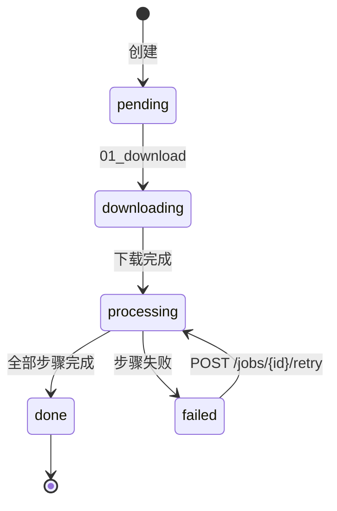
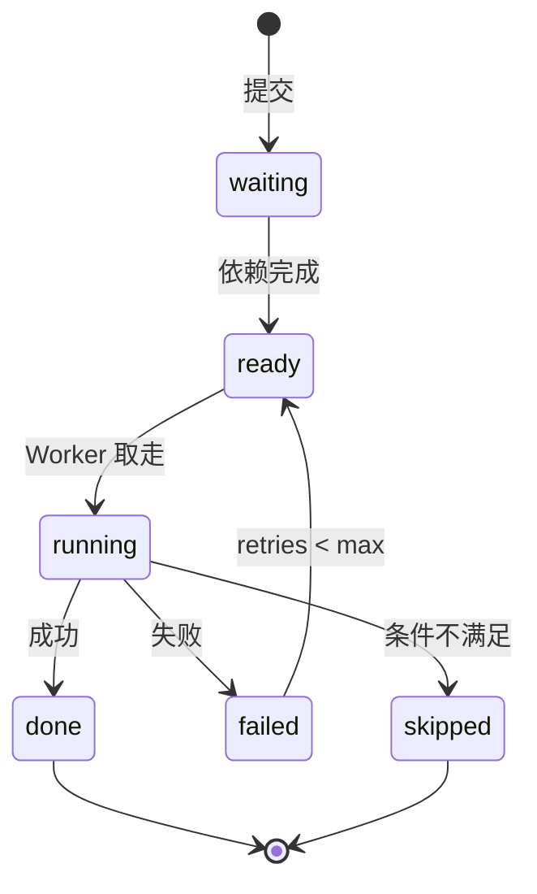

# 02 · 领域模型与知识体系

> **单一权威**。Part 1「知识体系」回答*内容如何变成知识*（为什么这么设计，按三条原则推导）；
> Part 2「实现参照」给实体 / 状态机 / 表结构 / 文件布局（怎么存）。两者冲突时以 Part 1 为准。
> 相关：[00-vision](00-vision.md)（愿景）、[06-prompt-engineering](06-prompt-engineering.md)（Profile/Prompt）。

---

# Part 1 · 知识体系：内容 → 知识

## 1.0 命题

**内容是流入，知识是沉淀。** 一篇篇视频/论文/文章是**情景**（你"看过什么"），知识库是**语义**（你"学会了什么"）。
情景会忘、会删；知识沉下来、越积越准。系统要做的，就是把"看过"自动转化为"学会"，并让"学会"反哺下一次"看"。

## 1.1 三条设计原则

整套模型由三条原则推导，下面三节（§1.2 / §1.6 / §1.7）逐条展开：

1. **符合人类学习逻辑** —— 情景记忆 → 语义记忆 → 巩固；概念连成图、有抽象层级。
2. **符合多领域学习** —— 知识按领域分桶，是一组**并行的概念图**，互不污染；同名异域是两个概念。
3. **符合多来源学习同一知识** —— 一个概念由多来源（论文+视频+文章）共同沉淀、相互佐证，定义越攒越好，不归属任何单一来源。

---

## 1.2 原则一 · 符合人类学习逻辑

认知科学里长期记忆分两类，学习的本质是前者向后者转化——这是整个模型的骨架：

| 认知科学 | 含义 | 在 Mnemo 里对应 |
|---|---|---|
| **情景记忆 (episodic)** | 对具体经历的记忆："我看过那个讲 327 国债的视频" | **Job**：一条内容 = 一次经历，带来源/时间/上下文 |
| **语义记忆 (semantic)** | 脱离来源的概念："国债期货是什么" | **概念节点**：领域内沉淀的知识，不属于任何视频 |
| **巩固 (consolidation)** | 多场合反复遇到 → 情景抽象成语义；忘了在哪学的，但记住了概念 | **①抽取 + ②索引**：每篇笔记吐概念并登记 occurrence；同一概念被反复遇见 → 节点强化、定义精炼、佐证升级 |
| **图式 (schema)** | 概念连成网，新知识挂靠到已有网 | **概念图**（节点 + `related` 关联边） |
| **抽象层级** | 概念有上下位："宏观经济" ⊃ "国债期货" | **同一张概念图的不同层级**（见下：主题 vs 术语） |
| **同化 (assimilation)** | 用已有知识理解新经历，并把新知识挂进既有图式 | **③回流 + 挂靠**：已知概念喂 Prompt、只标真新词；新概念索引时连 related/上下位边，挂进既有概念网（§1.5） |

**由"抽象层级"推出的关键统一**：人脑里"宏观经济"和"国债期货"不是两种东西，是**同一张概念网的粗节点与细节点**。所以系统里：
- **术语**＝细粒度概念节点（有定义、出现处），用于**检索知识**；
- **主题**＝粗粒度概念节点的**浏览面**（"宏观经济"下挂一批内容），用于**组织内容**；
- 二者**同在一张概念图**，靠 `related` 连成上下位层级（`宏观经济 ⊃ 国债期货`）。不是两套东西（详见 §1.5）。

**三条硬结论**（决定后面所有设计）：

1. 语义**不归属**某次情景——"国债期货"不是"第一个讲它的视频"的私产；**谁先解析谁占坑是错的**。
2. 语义**靠多源巩固而增强**——被越多来源提及，定义越全、佐证越强（→ §1.7）。
3. 语义**比情景长命**——删掉某视频，概念仍在（忘了在哪学，但还记得它）。

---

## 1.3 结构：领域是锚，两轴 + 一层 flag

**Domain 是一切的上下文**——它给实体定调：决定**知识库归属**和 **Profile/Prompt**。一个领域内只有**两根正交的轴** + 一层纯标签：

| 轴 | 是什么 | 基数 | 回答 |
|---|---|---|---|
| **集合 collection**（归属轴/情景） | job 的"家"：来源(订阅) 或 手动一桶 | job **多对一** | 它从哪来 |
| **概念图 concept-graph**（知识轴/语义，=交叉轴） | 领域的概念网：细看是**术语**(知识)、粗看是**主题**(浏览) | concept N>──<N job | 它讲什么 / 我学到啥 |
| meta 标签（纯 flag） | `入门`/`已看`/`必看`/`2024` 等组织标记，无知识含义 | 多对多 | 纯整理 |

> 关键：交叉归类（"一个视频跨多个题"）由**概念图**承担（挂多个概念节点），**不**靠"一个 job 进多个集合"。

**领域是锚，集合是可选中间层**：job 通过 `job.domain` **直接**锚定领域，不必经过集合。

```
domain（一个知识领域）
 ├── collections（可选分组 = 归属轴）
 │      └── jobs（collection_id 已设）
 └── jobs（collection_id = NULL，未分类，但仍直接属于该 domain）
 ╎
 ╎ （正交的知识轴）
 └┄┄ 概念图：jobs 抽取/提及的概念沉淀于此，按 domain 分桶

基数
  Domain     1 ──< N  Collection      集合属于恰好一个领域
  Domain     1 ──< N  Job             job.domain 直接锚定（与 collection 无关，可未分类）
  Domain     1 ──< N  Concept         概念按领域沉淀（§1.5/§1.6）
  Collection 1 ──< N  Job             多对一，collection_id 可空(=未分类)
  Job        1 ──< N  Step            流水线步骤执行记录
  Concept    N >──< N  Job            通过 occurrences 多对多，跨集合
```

**一个 job 的完整归类** = `1 个 domain` + `≤1 个家集合` + `N 个概念`（其中粗节点即它的主题）+ `N 个 meta 标签`。

---

## 1.4 集合（归属轴）—— 订阅是「集合」的子集

**`所有集合 = 手动集合 ∪ 订阅集合`，且 `订阅集合 ⊊ 集合`**：订阅集合 *是* 一种集合（is-a），只是多带一组「自动来源」属性。它**不是并列实体、没有独立页面**。

「手动投递」是所有集合的通用能力；「订阅」是其上additional 挂的自动 feeder（**纯增量，从不剥夺手动**）：

| 集合种类 | 成员规则 | 额外属性 |
|---|---|---|
| **手动集合** | 仅手动投递 URL，自行策展（**异构**：跨内容类型/来源） | 无 |
| **订阅集合** | 手动投递（依然在）**+** 自动拉取某来源（B站 UP 主）新内容 | `source_type`/`source_id`/`sync_enabled`/`last_synced_at` |

```
Collection「LLM 学习」 (domain: deep-learning)  ← 手动集合（跨类型/来源，同一 domain）
  ├── Job 某论文精读视频 (video, bilibili)  ├── Job Attention…(paper, arxiv)
  └── Job 某讲解视频 (video, youtube)        └── Job 某博客 (article, web)

Collection「财经说(PAKEN)」(domain: finance)  ← 订阅集合 source_type=bilibili_up, source_id=247209804
  ├── Job BV…（自动拉取）  └── Job BV…（你手动补充的相关视频）← 允许
```

- 集合恒为**单 domain**，但可跨内容类型/来源。
- 一个 domain 可含**多个订阅集合**（每个对应一个来源/UP）+ 多个手动集合；它们的概念**都沉进同一个 domain 概念图**（§1.7 多源巩固正发生于此）。
- 每个来源(mid)**全局唯一**对应一个订阅集合（id `col_bili_up_{mid}`）→ 同一 UP 只能归一个 domain。
- **约束**：新建订阅集合**必须显式选 domain**（不得默认 `general`），否则该 UP 的概念沉进错误领域库。

---

## 1.5 概念图（知识轴）—— 术语与主题统一

**概念是一等知识节点，内容只是它的"出现"。术语与主题是同一张图的两端：**

```
Concept  key = (domain, name)
  · definition    跨来源综合的标准定义；可人工钉住/改写（curate 覆盖机器）
  · occurrences[] 这个概念"出现在哪"——见下；不是"来源占坑"
  · related[]     关联概念（**仅同域**） → 上下位/相关 边，构成 schema 图
  · attestation   佐证强度【派生·不落列，由 occurrences 算，§1.7】
  · is_topic      是否"浏览主题"（通常是粗粒度节点，给它一个内容聚合落地页）
  · definition_locked  人工钉住后，语料增长不再自动覆盖定义（§1.7 / §1.10-11）
  · status        suggested / accepted
```

| | 术语（细粒度节点） | 主题（粗粒度节点的浏览面，`is_topic`） |
|---|---|---|
| 用途 | 检索知识：它是什么 | 组织内容：它下面有哪些视频 |
| 页面 | 术语页（定义 + 关联 + 出现处） | 主题页（域内跨集合/跨来源聚合内容） |
| 例 | 国债期货、收益率倒挂 | 宏观经济、杠杆案例 |

二者**同表同图**，`related` 给层级（`宏观经济 ⊃ {国债期货, 利率, 收益率倒挂}`）。**主题 ⊆ 概念**，不是独立实体；只有 meta 标签（§1.3）才是与知识无关的纯标签。

**出现 (occurrence) ≠ 来源 (source)**——对称、带类型与位置：

```
occurrence = { job_id, content_type(video/paper/article/audio), location }
   location: video/audio→时间点;  paper→页/章节;  article→锚点
```
任何提到该概念的内容都登记一条，无先后；"美债收益率倒挂 出现在 7 处" = 跨内容引用索引。
**域绑定**：一条 occurrence 只把概念连到**同 domain** 的 job（`concept.domain == job.domain`），不跨域登记（§1.10-10）。

**沉淀比来源长命**：删 job 只摘它在各概念的 occurrence，**保留**概念与定义（"沉淀"不是"缓存"）。

---

## 1.6 原则二 · 符合多领域学习

**知识不是一张大图，是一组按领域分桶的并行概念图。** 领域是概念的**命名空间**：

- 概念主键是 `(domain, name)`：**同名异域 = 两个独立节点**，因为含义是领域相对的——
  - `注意力`：deep-learning（Transformer 的 QKV 权重） ≠ 心理学（认知资源分配）；
  - `杠杆`：finance（融资放大收益/风险） ≠ 物理（省力机械）；
  - `正则化`：deep-learning（防过拟合的惩罚项） ≠ 数学（使发散量有限的手段）。
- 强行合并跨域同名概念会**互相污染**定义与佐证；分桶则各领域概念图干净、定义精准。
- 领域还是 **Profile/Prompt 的作用域**：同一概念在不同领域用不同风格解释（见 06）。
- **一个创作者归一个领域**（`col_bili_up_{mid}` 全局唯一，§1.4）→ 其内容只喂一个领域的概念图，避免一个泛 UP 把概念撒进多个库。

**对应人类学习**：你为每个领域建**独立的心智模型**；学金融时的"杠杆"和学物理时的"杠杆"在脑中是两个概念，不会混。跨领域检索靠**搜索**横跨（§Part2 全文索引），概念节点不自动跨域合并。`related` 边**仅限同域**（元素是裸 `name`，只在本域解析）；跨域关联边属未来增强，需把 `related` 元素升级为带 domain 的引用 `{domain, name}`，**当前不支持**。

---

## 1.7 原则三 · 符合多来源学习同一知识

一个概念由**多来源共同沉淀**，这是 §1.2 第 2 条硬结论的工程化：

- **多来源 = 多 occurrence，类型化**：论文、视频、文章、音频各记一条，带位置。**没有"第一个讲的占坑"**，对称登记。
- **定义跨源综合，不取自单源**：论文给**严谨**、视频给**直觉**、文章给**应用**——AI 综合出的定义优于任何单一来源，且**随语料增长而精炼**；用户可**钉住**为标准版（钉住后语料增长只更新 occurrences/佐证，**不覆盖**定义，§1.10-11）。
- **佐证强度 attestation（派生）** = 来源**广度**（几个不同 job）× **多样性**（几种 content_type）。一个被多源多类型提及的概念，比只被 1 个视频带过的，**可信度与中心度都更高**——这就是主题页/术语页里的 ★ 排序依据。（来源**权威度**——原始论文 vs 二手讲解——当前 occurrence 不足以判定，列为未来可选维度，暂不计入 ★。）
- **冲突即信息**：来源对同一概念说法不一时，综合定义在正文里以**人读注记**标注共识与分歧（MVP 不做结构化关联：删源不自动清理该注记）。
- **巩固 = 跨源反复遇见**（即 §1.8 的 ②索引重复登记）：同一概念在不同来源、不同语境被再次提及，就强化该节点、补全定义（对应人脑"多样化重复"比"单一重复"记得更牢）。
- **持久**：节点比任一来源长命（§1.5）。

> 例：`(finance, 国债期货)` 的 occurrences 来自 财经说 BV…(video, 12:30) + 某游资 BV…(video, 03:10) + 一篇研报(article)；定义综合三者，佐证 ★★★。删掉其中一个视频，节点与定义不变，只少一条 occurrence。

---

## 1.8 知识闭环（三向数据流）

把"看过"变成"学会"、再反哺"看"的环：

```
① 抽取 extract   生成笔记时吐"这篇讲清楚了哪些概念 + 候选定义" → 按 job.domain 入 (job.domain, 概念) 候选桶 + 登记 occurrence
② 索引 index     笔记正文与已接受概念后处理匹配，命中包成链接，并登记该笔记为这些概念的 occurrence；新概念连 related/上下位边挂进 schema（双向、零先后偏差）
③ 回流 feedback  生成新笔记时，把该 domain 已接受概念的标准定义喂进 Prompt：已知概念用统一措辞、只标真新词
```
> 认知映射（§1.2）：**巩固 = ①+②**（反复登记强化节点）；**同化 = ③ + ②的挂边**（用旧识新 + 新概念挂进既有图式）。

- 主题页/浏览 = 对 `is_topic` 的粗节点做内容聚合，**与抽取同源**（抽取一次，既沉淀知识又生成可浏览主题，不维护两套）。
- 评审的 `missing_concepts` 是「知识缺口」（讲漏了什么），属评审面板/选题建议，**不是**概念库主喂养源；主源是 ①「讲清楚了什么」。

---

## 1.9 全景图

```
        ╔══════════ DOMAIN: finance ══════════╗   ╔═ DOMAIN: deep-learning ═╗
        ║ 语义层·学会了什么   情景层·看了什么  ║   ║ （并行的另一张概念图，  ║
        ║  ┌ 概念图 ────┐   ┌ 集合(归属) ──┐  ║   ║   "注意力"在此是另一个  ║
        ║  │ 宏观经济(主题)│  │📡财经说(订阅) │ ║   ║    节点，互不污染)      ║
        ║  │  ├国债期货(术语)│ │📡某游资(订阅) │ ║   ╚═════════════════════════╝
        ║  │  ├利率        │  │📁宏观精选(手动)│ ║
        ║  │  └收益率倒挂   │  └──────┬───────┘ ║   ① 抽取  ② 索引  ③ 回流
        ║  └──▲──▲────────┘         │ 1──<N    ║   ───────────────────────
        ║     │  │ occurrences      ┌─┴── JOB ──┐║   抽取→候选概念+定义+occurrence
        ║   ③回流│ (typed+located)  │ ≤1 集合   │║   索引→正文匹配，双向登记
        ║     └──┴── 巩固 ◀─────────┤ N 概念    │║   回流→已知定义喂 Prompt
        ║      内容反复被提及→概念被强化└N meta标签┘║
        ╚══════════════════════════════════════╝
```

> **横看**：看了什么/怎么归拢（集合）。**竖看**：学会了什么（概念图）。两轴在 domain 内正交。
> **域间**：每个领域一张独立概念图（原则二）。**源间**：一个概念聚多来源的 occurrence（原则三）。

---

## 1.10 不变式与约束

1. `job.collection_id` 多对一、可空；删集合 → 名下 job 解绑（置 NULL），**不删 job**。
2. `collection.domain` 恒等于其名下所有 job 的 domain（投递/订阅时继承，不漂移）。
3. 订阅字段是 collection 的列；**无独立 subscription 实体/页面/路由**。
4. 订阅集合**必选真实 domain**，禁止默认 `general`。
5. 概念主键 `(domain, name)`；**同名异域是两个节点**（原则二）。
6. occurrence 对称登记、类型化，无"首解析占坑"；定义独立于 occurrence 存储与 curate（原则三）。
7. 删内容只摘 occurrence，**保留**概念与定义。
8. 一个领域内只有两轴：**集合=单一归属（多对一）** / **概念图=知识兼交叉（术语细↔主题粗，同图）**；交叉**不**用多对多集合表达。
9. **主题 ⊆ 概念**（`is_topic` 的节点）；只有 meta 标签是与知识无关的纯 flag。
10. **occurrence 域绑定**：`concept.domain == job.domain`；抽取/索引按 `job.domain` 入桶，不跨域登记（这是"跨域不污染"的真正闸门）。`related` 边仅同域。
11. **钉住的定义不被自动综合覆盖**：`definition_locked` 后，语料增长只更新 occurrences 与佐证（派生），不动 `definition`，直到用户解钉。

---

# Part 2 · 实现参照

## 2.1 核心实体

### Collection（集合）

```python
@dataclass
class Collection:
    id: str                        # 手动 "col_{hex}"；订阅 "col_bili_up_{mid}"
    name: str
    domain: str                    # 单 domain → 继承该 domain 的 Profile/概念图
    description: str = ""
    tags: list[str] = field(default_factory=list)
    job_count: int = 0
    # 订阅属性（手动集合为 None；订阅集合填充）
    source_type: str | None = None     # "bilibili_up"
    source_id: str | None = None       # B站 mid
    sync_enabled: bool = True           # 自动追更开关
    last_synced_at: datetime | None = None
    created_at: datetime
    updated_at: datetime
```

> 旧的独立 `Subscription` 实体/表已废，其字段并入 Collection（见 §1.4、§2.3）。

### Job（任务）

```python
@dataclass
class Job:
    id: str                        # "jobs_bili_BV..." / "jobs_{cat}_{hash}"
    content_type: str              # "video" | "paper" | "article" | "audio"
    pipeline: str                  # 步骤链名 → pipelines.yaml
    collection_id: str | None      # 家集合（多对一，可空=未分类）
    url: str | None
    title: str | None
    domain: str                    # 继承自集合或独立指定（直接锚定领域）
    source: str                    # bilibili/youtube/arxiv/upload...（区分自动/手动来源）
    style_tags: list[str]          # meta 标签（纯 flag，§1.3）+ 风格标签 → 06
    status: JobStatus
    current_step: str | None       # 派生（job_steps 中 running），不存 DB
    progress_pct: int
    meta: dict                     # 内容类型特有：video {duration_sec}; paper {pages,authors}...
    created_at: datetime
    updated_at: datetime
    error: str | None
```

### Concept / Term（概念节点 = 知识轴）

```python
@dataclass
class Concept:                     # 表名仍为 glossary（历史）
    domain: str                    # 主键之一（命名空间，原则二）
    name: str                      # 主键之一（旧字段名 term）
    definition: str                # 跨源综合（原则三）
    definition_locked: bool = False # 钉住后语料增长不自动覆盖定义（§1.10-11）
    occurrences: list[dict]        # [{job_id, content_type, location}] 类型化出现处（替代旧 sources=[job_id]）
    related: list[str]             # 关联概念（仅同域）→ schema 图（含上下位）
    is_topic: bool = False         # 粗粒度浏览主题（给内容聚合落地页）
    status: str = "accepted"       # suggested / accepted
    created_at: datetime
    updated_at: datetime
    # attestation（佐证强度）由 occurrences 派生（广度×多样性），不落列
```

> 术语与主题是同一实体的两端：`is_topic=True` 的（通常粗粒度）节点额外获得"主题页"。meta 标签不在此表，存于 `job.style_tags`。

### Step / Worker

Step：`name`（各 pipeline 内 `01..N`）/status/pool/input_hash/worker_id/started_at/finished_at/duration_sec/meta/error/retries。
Worker：两份存储（Redis 心跳 + SQLite 持久），字段见 §2.3 `workers` 表。

## 2.2 状态机




**Step 跳过条件（视频 pipeline，键 01..N）**：`02_whisper`（已有 .srt）/ `07_danmaku`（无 .ass）/ `08_punctuate`（无 .srt）。跳过标 `skipped`，不阻塞后续。

## 2.3 数据库表结构

SQLite，直接写 SQL，不用 ORM。下表反映当前已落库的 schema（订阅并入 collection 列、概念图 typed occurrences、`notes_fts5` trigram 等均已实现）。

```sql
CREATE TABLE jobs (
    id TEXT PRIMARY KEY,
    content_type TEXT NOT NULL,           -- video/paper/article/audio
    pipeline TEXT NOT NULL,
    collection_id TEXT,                    -- 家集合，多对一，可空
    url TEXT, title TEXT,
    domain TEXT NOT NULL DEFAULT 'general',
    source TEXT,
    style_tags TEXT DEFAULT '[]',          -- meta 标签 + 风格标签
    status TEXT NOT NULL DEFAULT 'pending',
    progress_pct INTEGER DEFAULT 0,
    meta TEXT DEFAULT '{}',
    created_at TEXT NOT NULL, updated_at TEXT NOT NULL, error TEXT
);
CREATE INDEX idx_jobs_status ON jobs(status);
CREATE INDEX idx_jobs_collection ON jobs(collection_id);

-- 集合（订阅属性内联，无独立 subscriptions 表）
CREATE TABLE collections (
    id TEXT PRIMARY KEY,                   -- col_{hex} / col_bili_up_{mid}
    name TEXT NOT NULL,
    domain TEXT NOT NULL,
    description TEXT DEFAULT '',
    tags TEXT DEFAULT '[]',
    job_count INTEGER DEFAULT 0,
    source_type TEXT,                      -- NULL=手动；"bilibili_up"=订阅
    source_id TEXT,                        -- B站 mid
    sync_enabled INTEGER DEFAULT 1,        -- 自动追更开关
    last_synced_at TEXT,
    created_at TEXT NOT NULL, updated_at TEXT NOT NULL
);

CREATE TABLE job_steps (
    job_id TEXT NOT NULL REFERENCES jobs(id),
    step TEXT NOT NULL,                    -- 各 pipeline 内 01..N
    status TEXT NOT NULL DEFAULT 'waiting',
    pool TEXT NOT NULL, input_hash TEXT, worker_id TEXT,
    started_at TEXT, finished_at TEXT, duration_sec REAL,
    meta TEXT, error TEXT, retries INTEGER DEFAULT 0,
    PRIMARY KEY (job_id, step)
);

CREATE TABLE workers (
    id TEXT PRIMARY KEY, type TEXT NOT NULL, pools TEXT NOT NULL DEFAULT '[]',
    tags TEXT NOT NULL DEFAULT '[]', reject_tags TEXT NOT NULL DEFAULT '[]',
    hostname TEXT, gpu_name TEXT, gpu_memory_mb INTEGER,
    status TEXT NOT NULL DEFAULT 'offline', current_job TEXT, current_step TEXT,
    tasks_completed INTEGER DEFAULT 0, tasks_failed INTEGER DEFAULT 0,
    total_duration_sec REAL DEFAULT 0,
    first_seen TEXT NOT NULL, started_at TEXT, last_heartbeat TEXT, admin_note TEXT
);

-- 概念图 / 知识层（表名仍叫 glossary）
CREATE TABLE glossary (
    domain TEXT NOT NULL,                  -- 命名空间（原则二）
    term TEXT NOT NULL,                    -- 概念名
    definition TEXT DEFAULT '',            -- 跨源综合（原则三）
    definition_locked INTEGER DEFAULT 0,   -- 钉住后不被自动综合覆盖（§1.10-11）
    occurrences TEXT DEFAULT '[]',         -- [{job_id,content_type,location}] 类型化出现处（替代旧 sources）
    related TEXT DEFAULT '[]',             -- 关联概念（仅同域，含上下位）
    is_topic INTEGER DEFAULT 0,            -- 粗粒度浏览主题
    status TEXT DEFAULT 'accepted',        -- suggested/accepted
    created_at TEXT, updated_at TEXT,
    PRIMARY KEY (domain, term)             -- 同名异域是两个节点
);
CREATE INDEX idx_glossary_domain_status ON glossary(domain, status);

CREATE TABLE ai_usage (
    id INTEGER PRIMARY KEY AUTOINCREMENT,
    exec_id TEXT NOT NULL UNIQUE, job_id TEXT, step TEXT,
    provider TEXT NOT NULL, model TEXT NOT NULL,
    input_tokens INTEGER, output_tokens INTEGER,
    cost_usd REAL, duration_sec REAL, cached INTEGER DEFAULT 0,
    created_at TEXT NOT NULL
);

-- 全文搜索（表名 notes_fts5）：跨领域检索的逃生口（原则二）
-- trigram tokenizer 对中文做子串匹配，零外部依赖。
CREATE VIRTUAL TABLE notes_fts5 USING fts5(
    job_id UNINDEXED, content_type UNINDEXED, note_type UNINDEXED,
    collection_id UNINDEXED, domain UNINDEXED,
    title, body,
    tokenize='trigram'
);

-- annotations（视频回放标注）尚未建表，属 M3（视频回放 + 标注 + PDF 导出），见 ROADMAP。
```

## 2.4 文件存储布局

```
/data/
├── jobs/{job_id}/
│   ├── job.json                  # 任务元信息（含凭证, 不对外暴露）
│   ├── input/                    # metadata.json + 原始内容(video:source.mp4,*.srt,danmaku.ass; paper:source.pdf; article:source.html)
│   ├── intermediate/             # 步骤间中间产物
│   ├── assets/                   # 截图/图表(video:scene_*.jpg; paper:figure_*.png)
│   ├── output/                   # notes_mechanical.md / transcript.md / review.json
│   │   └── versions/             # notes_smart_{provider}_{model}_{ts}.md, review_{...}.json
│   └── logs/{step}.log
├── cookies/  ├── configs/(pools/pipelines/domain)  ├── prompts/(.../profiles/styles)  └── db/analyzer.db
```

## 2.5 实体关系 + ID 规则

```
Domain        1 ──< N Collection      （同 domain 共享 Profile/概念图）
Domain        1 ──< N Job             （job.domain 直接锚定，可未分类）
Collection    1 ──< N Job             （多对一；可跨 content_type/source；单 domain）
Job           1 ──< N Step / Annotation(M3)
(domain,name) N >──< N Job            （概念通过 occurrences 跨集合关联）
```

| 实体 | 格式 | 示例 |
|------|------|------|
| Job | `jobs_bili_{BV}` / `jobs_{cat}_{hash}` | `jobs_bili_BV1xx...` |
| Collection（手动 / 订阅） | `col_{8 hex}` / `col_bili_up_{mid}` | `col_bili_up_247209804` |
| Worker | `{type}-{8 hex}` | `ai-a1b2c3d4` |
| Step | 各 pipeline 内 `NN_name` | `03_scene` |
| Concept | 复合键 `(domain, name)` | `(finance, 国债期货)` |

## 2.6 落地状态

本模型已落地（M2 知识库 + T1/T2/T3 迁移完成）。下表记录从早期实现到当前模型的演进，便于读历史代码/数据时对照：

| 能力 | 早期实现 | 当前（已落地） |
|---|---|---|
| 三层容器 | domain/collection/job；job→collection 多对一 | 维持 |
| 订阅 | 独立 `subscriptions` 表 + 独立页面 + 自动建同名集合 | ✅ 并入 collection 列；删页面/路由；domain 必选 |
| 集合 id | `c_{date}_{hex}` 随机 | ✅ `col_{hex}` / `col_bili_up_{mid}` |
| 交叉/主题 | 仅 `job.tags`（无落地页/不策展） | ✅ 概念图中 `is_topic` 节点的浏览面（与术语同表统一）；meta 标签才是纯 flag |
| 概念喂养 | 仅评审 `missing_concepts` → 候选 | ✅ 改为评审 `key_terms`（笔记讲清楚的概念 + 候选定义）为主源；`missing_concepts` 仅评审面板、不入库 |
| occurrence | `sources=[job_id]`，无类型/位置 | ✅ typed + located 对称索引 `[{job_id,content_type,location}]` |
| 定义跨源 | 手动录入为主，不随语料增长 | ✅ 跨源综合 + 佐证(广度×多样性) + 钉住不被覆盖（原则三） |
| 多领域 | 概念主键已 `(domain,term)` | 维持分桶；跨域同名不合并（原则二） |
| 回流 | 无（Prompt 不读概念库） | ✅ 采纳的概念回流 Profile.terminology，注入 Prompt：统一措辞、只标新词 |
| 笔记内联 | 正文不可点 | 后处理匹配 → 可点（定义/关联/出现处） |
