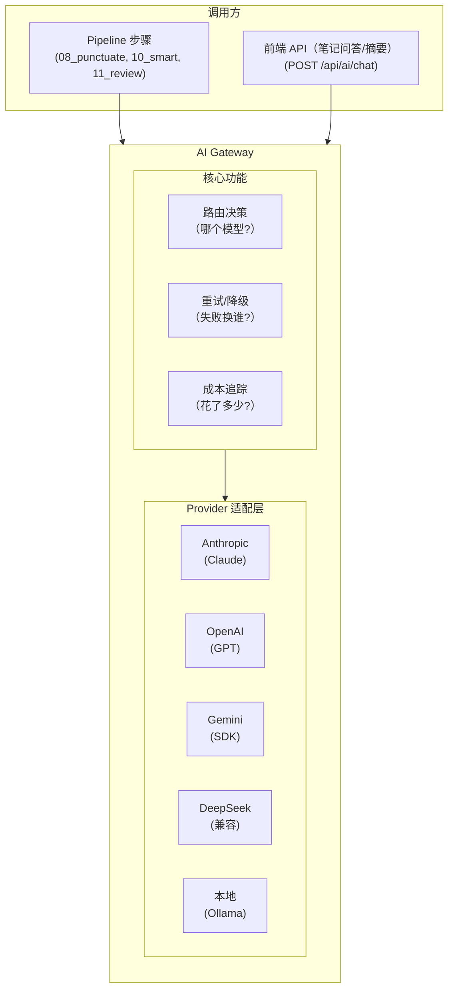

# AI 网关

> 统一的 LLM 调用层。Pipeline 步骤和前端交互都通过它访问 AI，支持多 Provider、多模型、路由、对比、降级。

## 1. 为什么需要网关

- 不同步骤对模型能力/成本要求不同（标点用廉价模型，笔记用强模型）
- 同一步骤想用多个 Provider 生成对比结果
- 前端需要交互式 AI（笔记问答）
- 统一管理 API key、配额、限流、成本追踪
- Provider 故障时自动降级到备选

## 2. 架构



## 3. Provider 适配

所有 Provider 统一为一个接口：

```python
class LLMProvider:
    async def complete(self, request: LLMRequest) -> LLMResponse:
        """统一调用接口"""
        ...

@dataclass
class LLMRequest:
    messages: list[dict]           # [{"role": "user", "content": ...}]
    model: str                     # "claude-sonnet-4-6" / "deepseek-v4-flash" / ...
    max_tokens: int
    temperature: float = 0.7
    images: list[Path] | None = None   # 多模态输入
    system: str | None = None
    response_format: str | None = None  # "json" | None

@dataclass
class LLMResponse:
    content: str
    model: str                     # 实际使用的模型
    provider: str                  # "anthropic" / "openai" / "deepseek" / "local"
    input_tokens: int
    output_tokens: int
    cost_usd: float                # 本次调用成本
    duration_sec: float
    cached: bool                   # prompt cache 命中
```

### 三种接入方式

| 方式 | 说明 | 成本模型 | 适合场景 |
|------|------|---------|---------|
| **API Key** | 直接调 Provider HTTP API | 按 token 计费 | 生产批量处理 |
| **CLI 订阅** | subprocess 调 `claude`/`gemini` CLI | 订阅月费内 | 轻量使用/开发阶段 |
| **本地模型** | 调本地 Ollama/vLLM | 免费（电费+硬件） | 简单任务/隐私敏感 |

CLI 订阅方式有额度限制，适合日处理量不大或开发调试阶段。超出额度后 Gateway 自动降级到 API Key 或其他 Provider。

### 已支持 Provider

**API Key 接入**：

| Provider | 协议 | 模型示例 | 特点 |
|----------|------|---------|------|
| Anthropic | 原生 SDK | claude-opus-4-6, claude-sonnet-4-6, claude-haiku-4-5 | 质量最高，支持 Batch/Caching |
| OpenAI | 原生 SDK | gpt-4o, gpt-4o-mini | 生态最大 |
| Google | 原生 SDK | gemini-2.5-pro, gemini-2.5-flash | 超长 context，原生视频理解 |
| DeepSeek | OpenAI 兼容 | deepseek-v4-pro, deepseek-v4-flash | 极便宜，中文好 |
| Qwen | OpenAI 兼容 | qwen3-72b, qwen3-7b | 中文强，有 API 也有本地版 |

**CLI 订阅接入**：

| Provider | CLI 命令 | 订阅计划 | 说明 |
|----------|---------|---------|------|
| Claude | `claude -p` | Pro/Max | 月度 Agent SDK Credit 内免费，超出按 API 价 |
| Gemini | `gemini` | Google One AI Premium | 有免费额度 |

CLI Provider 的实现是 subprocess 调用 + stdout 解析，与 API Provider 对调用方透明：

```python
class ClaudeCLIProvider(LLMProvider):
    async def complete(self, request: LLMRequest) -> LLMResponse:
        prompt_file = write_temp_prompt(request)
        result = subprocess.run(
            ["claude", "-p", str(prompt_file), "--output-format", "text"],
            capture_output=True, text=True, timeout=request.timeout
        )
        if result.returncode != 0:
            raise ProviderError(result.stderr)
        return LLMResponse(
            content=result.stdout.strip(),
            provider="claude-cli", model="subscription",
            cost_usd=0.0,  # 订阅额度内不额外计费
            ...
        )
```

**本地模型**：

| 引擎 | 协议 | 特点 |
|------|------|------|
| Ollama | OpenAI 兼容 | 最简单，`docker run ollama` 即用 |
| vLLM | OpenAI 兼容 | 高吞吐，适合批量 |

OpenAI 兼容 Provider（DeepSeek/Qwen/Ollama/vLLM）只需配置 `base_url` + `api_key`，无需写适配代码。

## 4. 配置

### providers.yaml

```yaml
providers:
  anthropic:
    type: anthropic
    api_key: ${ANTHROPIC_API_KEY}
    models:
      - claude-opus-4-6
      - claude-sonnet-4-6
      - claude-haiku-4-5
    features: [vision, batch, caching]

  openai:
    type: openai
    api_key: ${OPENAI_API_KEY}
    models:
      - gpt-4o
      - gpt-4o-mini
    features: [vision]

  deepseek:
    type: openai_compatible
    base_url: https://api.deepseek.com/v1
    api_key: ${DEEPSEEK_API_KEY}
    models:
      - deepseek-v4-pro
      - deepseek-v4-flash
    features: []

  gemini:
    type: google
    api_key: ${GOOGLE_API_KEY}
    models:
      - gemini-2.5-pro
      - gemini-2.5-flash
    features: [vision, video, long_context]

  # ── CLI 订阅接入（可选，有订阅的用户配置）──

  claude-cli:
    type: cli
    command: ["claude", "-p", "{prompt_file}", "--output-format", "text"]
    env:
      HOME: /home/user
      HTTPS_PROXY: ${HTTPS_PROXY:-}
    volumes:                               # Docker 挂载（08-deployment 中配置）
      - ~/.claude:/home/user/.claude
      - ~/.local/share/claude:/home/user/.local/share/claude:ro
      - ~/.local/bin/claude:/usr/local/bin/claude:ro
    features: [vision]
    cost_usd: 0                            # 订阅额度内不计费

  gemini-cli:
    type: cli
    command: ["gemini", "-p", "{prompt_file}"]
    features: [vision, video]
    cost_usd: 0

  # ── 本地模型 ──

  local:
    type: openai_compatible
    base_url: http://ollama:11434/v1
    api_key: ollama
    models:
      - qwen3:7b
      - qwen3:32b
    features: []
    cost_usd: 0
```

用户按需配置——只有 API key 就用 API，有 CLI 订阅就用 CLI，有 GPU 就用本地模型。Gateway 不要求全部配齐。

### 步骤 AI 需求分级

| 步骤 | 需要视觉 | 复杂度 | 可用最低模型 |
|------|---------|--------|-------------|
| 08_punctuate | 否 | 低 | 本地 7B / DeepSeek Flash |
| 10_smart 视觉 pass | **是**（逐帧看图产视觉描述） | 高 | Sonnet / GPT-4o（需 vision，claude-cli 带 Read 逐帧） |
| 10_smart 文本 pass | 否（机械稿 + 视觉描述生成笔记） | 中-高 | DeepSeek Pro / Sonnet（纯文本单轮） |
| 11_review | 否 | 低-中 | Haiku / DeepSeek Flash |
| 前端问答 | 否（通常） | 低 | Haiku / DeepSeek Flash |
| 前端看图提问 | **是** | 中 | 需 vision 模型 |

`10_smart` 是**两段式**：① 视觉 pass 用视觉模型（claude-cli 带 Read 逐帧看图、限 10 张防上下文膨胀）产「逐帧视觉描述」清单；② 文本 pass 把机械稿 + 视觉描述走纯文本单轮（`--tools "" --max-turns 1`）生成笔记。只有视觉 pass 必须 vision 模型，其余步骤用纯文本模型即可，成本大幅降低。

### 步骤路由配置（pipelines.yaml）

pipeline 为 GitLab-CI 风格（`variables`/`extends`/`needs`/`rules`，见 [docs/03-contracts.md §4.1](../03-contracts.md)），每个 AI job 的 `ai` 段路由 provider/model（`variables` 为单一事实源，job 用 `$VAR` 引用）：

```yaml
video:
  jobs:
    "08_punctuate":
      extends: .ai-step
      ai:
        primary: {provider: deepseek, model: deepseek-v4-flash}
        fallback: {provider: local, model: qwen3:7b}

    "10_smart":
      extends: .ai-step
      tags: ["vision"]                 # 视觉 pass 需要视觉能力的 Worker
      ai:
        primary: {provider: anthropic, model: claude-sonnet-4-6}
        fallback: {provider: openai, model: gpt-4o}
        # 文本 pass / 纯文本降级
        text_fallback: {provider: deepseek, model: deepseek-v4-pro}

    "11_review":
      extends: .review
      ai:
        primary: {provider: anthropic, model: claude-haiku-4-5}
        fallback: {provider: deepseek, model: deepseek-v4-flash}
```

`tags` 控制哪个 Worker 能接这个任务（亲和性），`ai` 控制 Gateway 在该 Worker 上用哪个 Provider/Model。两层独立。

## 5. 多 Provider 对比生成

> 现状：已落地的是**换 provider 重跑**——`POST /api/jobs/{id}/rerun-smart` 用指定 provider 重新生成智能笔记 + 评审，生成新版本、旧版本版本化保留（见 [docs/03-contracts.md §1.1](../03-contracts.md)）。下文的「并行 compare 子任务」为更早的设计方向，未实现。

### 场景

用户想看 Claude/GPT/DeepSeek 分别生成的笔记，选最好的。

### 设计方向（未实现）

当步骤配置了 `compare` 列表时，调度器为该步骤创建多个子任务：

```
10_smart (compare mode)
  ├── 10_smart@anthropic  → output/notes_smart.anthropic.md
  ├── 10_smart@openai     → output/notes_smart.openai.md
  └── 10_smart@deepseek   → output/notes_smart.deepseek.md
```

所有子任务并行执行（不同 Provider 不占同一个资源槽）。

### 产物存储

```
/data/jobs/{id}/output/
├── notes_smart.md                    # 用户选定的最终版（或默认 primary）
├── notes_smart.anthropic.md          # Claude 生成版
├── notes_smart.openai.md             # GPT 生成版
├── notes_smart.deepseek.md           # DeepSeek 生成版
└── compare_meta.json                 # 对比元数据
```

```json
// compare_meta.json
{
  "step": "10_smart",
  "variants": [
    {"provider": "anthropic", "model": "claude-sonnet-4-6", "cost": 0.18, "duration_sec": 45, "file": "notes_smart.anthropic.md"},
    {"provider": "openai", "model": "gpt-4o", "cost": 0.15, "duration_sec": 30, "file": "notes_smart.openai.md"},
    {"provider": "deepseek", "model": "deepseek-v4-pro", "cost": 0.02, "duration_sec": 20, "file": "notes_smart.deepseek.md"}
  ],
  "selected": "anthropic"
}
```

### 前端对比视图

```
┌──────────────────────���──────────────────────────────┐
│ 08 智能笔记 — 多 Provider 对比                       │
├─────────┬─────────┬─────────────────────────────────┤
│ Claude  │ GPT-4o  │ DeepSeek                         │
│ $0.18   │ $0.15   │ $0.02                            │
│ 45s     │ 30s     │ 20s                              │
├─────────┴─────────┴─────────────────────────────────┤
│                                                      │
│  [Tab: Claude ✓] [Tab: GPT-4o] [Tab: DeepSeek]     │
│                                                      │
│  ## 一、案例背景                                     │
│  ...（当前选中的 Provider 的笔记内容）               │
│                                                      │
├──────────────────────────────────────────────────────┤
│ [✓ 采用 Claude 版本] [重新生成] [全部重新对比]       │
└──────────────────────────────────────────────────────┘
```

## 6. 前端交互式 AI

### API

```
POST /api/ai/chat
{
  "job_id": "j_xxx",              // 可选，提供上下文
  "messages": [{"role": "user", "content": "这个视频里提到的注意力机制是什么意思？"}],
  "provider": "anthropic",        // 可选，不指定用默认
  "model": "claude-haiku-4-5"     // 可选
}
```

Response (streaming):
```
data: {"content": "注意力机制是指...", "done": false}
data: {"content": "让模型为不同输入位置分配权重...", "done": false}
data: {"content": "", "done": true, "usage": {"cost": 0.002}}
```

当提供 `job_id` 时，Gateway 自动将该 Job 的笔记/逐字稿作为 context 注入 system prompt。

### 使用场景

| 场景 | Provider | 说明 |
|------|----------|------|
| 笔记页问答 | Haiku / DeepSeek Flash | 基于笔记内容回答问题，便宜 |
| 术语解释 | Haiku / DeepSeek Flash | 点击术语弹出解释 |
| 跨视频总结 | Sonnet | 多个笔记的综合分析 |

## 7. 路由与降级

```python
class AIRouter:
    async def route(self, step_name: str, request: LLMRequest) -> LLMResponse:
        config = self.get_step_ai_config(step_name)

        # 尝试 primary
        try:
            provider = self.get_provider(config["primary"]["provider"])
            return await provider.complete(request)
        except (RateLimitError, ProviderDownError) as e:
            logger.warning(f"primary failed: {e}, trying fallback")

        # 尝试 fallback
        if "fallback" in config:
            provider = self.get_provider(config["fallback"]["provider"])
            return await provider.complete(request)

        raise AllProvidersFailedError(step_name)
```

## 8. 成本追踪

每次 AI 调用记录到 SQLite：

```sql
CREATE TABLE ai_usage (
    id INTEGER PRIMARY KEY AUTOINCREMENT,
    exec_id TEXT NOT NULL UNIQUE,        -- {step_exec_id}:{call_index}，防重复计费
    job_id TEXT,
    step TEXT,
    provider TEXT NOT NULL,
    model TEXT NOT NULL,
    input_tokens INTEGER,
    output_tokens INTEGER,
    cost_usd REAL,
    duration_sec REAL,
    cached INTEGER DEFAULT 0,
    created_at TEXT NOT NULL
);

-- exec_id 两层：
-- step_exec_id = Worker 生成，标识一次步骤执行（如 "ai-a1b2:1716000000000"）
-- call_index = Gateway 生成，标识该执行中的第 N 次 AI 调用（重试/降级会产生多次）
-- 完整格式：ai-a1b2:1716000000000:0, ai-a1b2:1716000000000:1, ...
```

前端 Settings 页展示：
- 今日/本月总成本
- 按 Provider 分布
- 按步骤分布
- 成本趋势图

## 9. Batch 优化（Anthropic 专项）

Pipeline 步骤天然是异步的，可以利用 Anthropic Batch API 半价：

```python
class AnthropicBatchProvider(AnthropicProvider):
    async def complete_batch(self, requests: list[LLMRequest]) -> list[LLMResponse]:
        """批量提交，24h 内返回，半价"""
        batch = await self.client.messages.batches.create(
            requests=[self._to_batch_request(r) for r in requests]
        )
        # 轮询等待结果
        while batch.processing_status != "ended":
            await asyncio.sleep(60)
            batch = await self.client.messages.batches.retrieve(batch.id)
        return self._parse_results(batch)
```

当队列中积累多个同类型请求时，Gateway 自动批量提交。

## 10. 对 StepBase 的改动

```python
# 旧：subprocess 调 CLI
def run_claude(self, prompt, ...):
    subprocess.run(["claude", "-p", ...])

# 新：通过 Gateway 调用
def call_ai(self, prompt: str, images: list[Path] = None, **kwargs) -> str:
    """通用 AI 调用，具体用哪个 Provider/Model 由配置决定"""
    request = LLMRequest(
        messages=[{"role": "user", "content": prompt}],
        images=images,
        system=self.load_system_prompt(),
        **kwargs
    )
    response = self.gateway.route(self.step_name, request)
    return response.content
```

步骤代码不关心底层用的是 Claude 还是 DeepSeek——Gateway 根据 pipelines.yaml 的 `ai` 配置自动路由。
