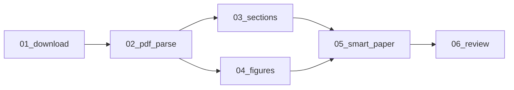

# 论文分析步骤

> 论文 pipeline 的步骤设计。M1 和视频一起实现。

## 总览



## Step 01: 下载 (steps.common.step_01_download 复用)

| 项目 | 值 |
|------|---|
| 池 | io |
| 输入 | job.json (url 或 upload=true) |
| 输出 | input/source.pdf + input/metadata.json |

来源识别：arXiv URL → 自动下载 PDF；本地 → 直接上传。

## Step 02: PDF 解析 (02_pdf_parse.py)

| 项目 | 值 |
|------|---|
| 池 | cpu |
| 依赖 | 01_download |
| 超时 | 2min |
| 输入 | input/source.pdf |
| 输出 | intermediate/parsed.json |

使用 PyMuPDF 或 pdfplumber 提取：
- 全文文本（按页）
- 章节标题（基于字号/加粗检测）
- 公式块（LaTeX 或图片）
- 图表位置和 caption
- 元数据（标题/作者/摘要）

### 输出格式

```json
{
  "title": "Attention Is All You Need",
  "authors": ["Vaswani et al."],
  "abstract": "...",
  "pages": 12,
  "sections": [
    {"level": 1, "title": "Introduction", "page": 1, "text": "..."},
    {"level": 2, "title": "Background", "page": 2, "text": "..."}
  ],
  "figures": [
    {"id": "fig1", "page": 3, "caption": "The Transformer architecture", "path": "assets/fig1.png"}
  ],
  "formulas": [
    {"id": "eq1", "page": 4, "latex": "Attention(Q,K,V) = softmax(QK^T/\\sqrt{d_k})V"}
  ]
}
```

### 验证

- parsed.json 可解析
- sections 非空
- title 非空

## Step 03: 章节结构 (03_sections.py)

| 项目 | 值 |
|------|---|
| 池 | cpu |
| 依赖 | 02_pdf_parse |
| 超时 | 1min |
| 输入 | intermediate/parsed.json |
| 输出 | intermediate/sections.json |

将 parsed.json 的章节整理为树形结构，提取每章的关键段落，生成机械版章节摘要（类似视频的 09_mechanical）。

## Step 04: 图表提取 (04_figures.py)

| 项目 | 值 |
|------|---|
| 池 | cpu |
| 依赖 | 02_pdf_parse |
| 超时 | 2min |
| 输入 | intermediate/parsed.json + input/source.pdf |
| 输出 | assets/fig*.png + intermediate/figures.json |

从 PDF 中裁切图表区域，保存为图片。对图表做 OCR 提取文字标注。

与 03_sections 并行执行（共同依赖 02_pdf_parse）。

## Step 05: 智能笔记 (05_smart_paper.py)

| 项目 | 值 |
|------|---|
| 池 | ai |
| 依赖 | 03_sections + 04_figures |
| 超时 | 10min |
| 输入 | intermediate/sections.json + figures.json + assets/*.png |
| 输出 | output/notes_smart.md |
| tags | [] （论文图表已由 04_figures 提取为文本描述，不必须 vision） |

AI 将论文内容重组为中文结构化笔记：
- 用中文重述论文核心贡献
- 保留关键公式（LaTeX 格式）
- 引用重要图表
- 与 Collection 内已有笔记的概念关联

Prompt 复用 video 10_smart 的模板结构，通过 Profile（如 `ml.yaml`）注入领域术语。

### 验证

- notes_smart.md >500 字符
- 包含论文标题
- 包含 `##` 章节
- 公式用 LaTeX 格式

## Step 06: 质量评审 (06_review.py)

| 项目 | 值 |
|------|---|
| 池 | ai |
| 依赖 | 05_smart_paper |
| 超时 | 2min |
| 输入 | intermediate/sections.json + output/notes_smart.md |
| 输出 | output/review.json |
| tags | [] |

复用视频 11_review 的扁平六维评分（completeness/accuracy/structure/terminology/visual_integration/readability）。额外检查：公式是否完整、图表引用是否正确。

## 与视频步骤的复用

| 组件 | 复用情况 |
|------|---------|
| StepBase | 完全复用 |
| 01_download | 复用，加 PDF/arXiv 识别 |
| AI Gateway | 完全复用 |
| Profile | 复用同 domain 的 Profile（如 ml.yaml） |
| Scheduler/Worker | 完全复用 |
| 前端笔记阅读 | 复用 Markdown 渲染（论文无视频回放） |
