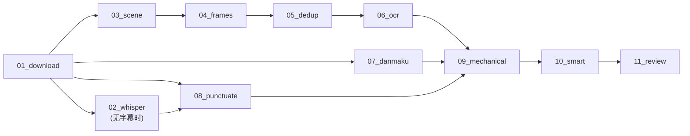

# 视频分析步骤

> 视频 pipeline 的步骤设计、接口、实现要点、验证标准。每步继承 StepBase 基类。

## 总览



> 步骤编号在每个 pipeline 内独立（video 为 `01..11`，paper `01..06`，article `01..05`，audio `01..05`），不是全局编号。

## Step 01: 下载 (step_01_download.py)

| 项目 | 值 |
|------|---|
| 池 | io |
| 依赖 | 无 |
| 超时 | 10min |
| 重试 | 3 |
| 输入 | job.json (url + source) |
| 输出 | input/source.mp4, input/subtitle.srt, input/danmaku.ass, input/metadata.json |

### 来源识别

| 来源 | 识别规则 | 下载器 | 字幕 |
|------|---------|--------|------|
| B站 | `bilibili.com` 或 `BV` 开头 | yutto | AI 字幕 |
| YouTube | `youtube.com` / `youtu.be` | yt-dlp | CC 字幕 |
| 本地上传 | job.json 有 `upload: true` | 不需要 | 手动/Whisper |
| 其他 | 兜底 | yt-dlp 通用 | 可能无 |

### Cookies

B站 1080P 需要登录 cookies（`/data/cookies/bilibili.txt`）。无 cookies 降级 480P。

### 验证

- input/source.mp4 存在且 >1MB
- input/metadata.json 有 duration_sec >0
- B站视频有 subtitle.srt

## Step 02: Whisper 语音转写 (step_02_whisper.py)

| 项目 | 值 |
|------|---|
| 池 | gpu（回退 cpu，但极慢） |
| 依赖 | 01_download |
| 条件 | input/ 下无 .srt 文件 |
| 超时 | 30min |
| 输入 | input/source.mp4 |
| 输出 | input/subtitle.srt |

GPU 可用时用 faster-whisper large-v3（float16），仅 CPU 时用 base（int8）。根据显存自动选模型大小。

## Step 03: 场景检测 (step_03_scene.py)

| 项目 | 值 |
|------|---|
| 池 | cpu（scene 已并入 cpu 池，不再独立/独占；单机抢资源由 per-worker 并发控制） |
| 依赖 | 01_download |
| 超时 | 10min |
| 输入 | input/source.mp4 |
| 输出 | intermediate/scenes.json |

使用 PySceneDetect AdaptiveDetector。配置项在 `configs/domain/{domain}.yaml` 的 `scene` 段。

### 关键配置

```yaml
scene:
  adaptive_threshold: 3.0
  min_scene_len_sec: 2.0
  window_width: 2
  min_content_val: 15.0
```

### 验证

- scenes.json 可解析
- scenes 数组非空
- 首个 scene 的 start_sec == 0
- 末个 scene 的 end_sec ≈ 视频时长 (±2s)

## Step 04: 关键帧提取 (step_04_frames.py)

| 项目 | 值 |
|------|---|
| 池 | cpu |
| 依赖 | 03_scene |
| 超时 | 2min |
| 输入 | intermediate/scenes.json + input/source.mp4 |
| 输出 | assets/*.jpg + intermediate/candidates.json |

每个场景取一张代表帧。超长场景（>30s）额外保底采样（每 15s 一张）。

### 代表帧选取策略

- 场景内 SSIM 变化小（静态）→ 取中间帧
- 场景内 SSIM 变化大（动态）→ 取 70% 位置的帧（等内容稳定后）

### 验证

- assets/*.jpg 数量 ≥ scenes 数
- 每张 jpg >10KB
- candidates.json 按 timestamp 排序

## Step 05: 截图去重 (step_05_dedup.py)

| 项目 | 值 |
|------|---|
| 池 | cpu |
| 依赖 | 04_frames |
| 超时 | 2min |
| 输入 | intermediate/candidates.json + assets/*.jpg |
| 输出 | intermediate/dedup.json |

两级去重：pHash 快速筛 → SSIM 精确确认。

```yaml
dedup:
  phash_hash_size: 8
  phash_threshold: 6
  ssim_threshold: 0.92
  ssim_resize: [320, 180]
```

### 验证

- dedup.json 长度 == candidates.json 长度
- 每项有 keep (bool) 和 phash (string)
- 保留率 25%-100%

## Step 06: OCR (step_06_ocr.py)

| 项目 | 值 |
|------|---|
| 池 | cpu / gpu |
| 依赖 | 05_dedup |
| 超时 | 5min |
| 输入 | intermediate/dedup.json + assets/*.jpg (keep=true) |
| 输出 | intermediate/ocr.json |

CPU 用 RapidOCR (ONNX)，GPU 用 PaddleOCR。通过 `device.py` 自动选路径。

### 验证

- ocr.json 长度 == keep=true 的帧数
- nonempty >30%（讲解类视频大部分帧有文字）

## Step 07: 弹幕提取 (step_07_danmaku.py)

| 项目 | 值 |
|------|---|
| 池 | io |
| 依赖 | 01_download |
| 条件 | input/ 下有 .ass 文件 |
| 超时 | 30s |
| 输入 | input/*.ass |
| 输出 | intermediate/danmaku.json |

解析 ASS 格式，过滤特效标签（`\move` 等），按时间排序。无 ASS 文件时输出空数组。

## Step 08: 字幕加标点 (step_08_punctuate.py)

| 项目 | 值 |
|------|---|
| 池 | ai |
| 依赖 | 01_download（或 02_whisper） |
| 条件 | input/ 下有 .srt 文件 |
| 超时 | 5min |
| 输入 | input/*.srt |
| 输出 | output/transcript.md |

AI 自动生成的字幕没有标点。用 Claude 给每行补标点，保留 `[MM:SS]` 时间戳。

长视频（>30000 字符）自动分块处理。

### 验证

- transcript.md 保留 `[MM:SS]` 时间戳
- 包含中文标点
- 行数与原 SRT 一致 (±10%)

## Step 09: 机械版笔记 (step_09_mechanical.py)

| 项目 | 值 |
|------|---|
| 池 | io (纯 Python 拼接) |
| 依赖 | 06_ocr + 07_danmaku |
| 超时 | 30s |
| 输入 | intermediate/dedup.json + ocr.json + danmaku.json + output/transcript.md |
| 输出 | output/notes_mechanical.md |

将截图、OCR、弹幕、逐字稿按时间线拼接成 Markdown。自动按时间切分章节（每 ~3 分钟一章）。

这是给 10_smart 的输入素材，也可独立阅读。

## Step 10: 智能版笔记 (step_10_smart.py)

| 项目 | 值 |
|------|---|
| 池 | ai |
| 依赖 | 09_mechanical |
| 超时 | 10min |
| 输入 | output/notes_mechanical.md + assets/*.jpg（最多 10 张） |
| 输出 | output/versions/notes_smart_*.md（版本化落盘，含生成时间/方式/模型） |

AI 将机械版素材重组为结构化笔记：提炼要点、解释术语、组织章节、引用关键截图。

Prompt 模板在 `{prompts_dir}/10_smart.md`，叠加领域 Profile（`profiles/{domain}.yaml`）和风格标签（`styles/{tag}.yaml`）。

### 两段式生成

把"看图"（必须 agentic、多轮 Read）与"成稿"（必须单轮纯文本输出）解耦，正文不再被 agentic 跑偏/丢正文污染：

1. **视觉 pass**（仅当有截图时）：claude 带 `Read` 工具逐张查看截图，**只产出"逐帧视觉描述"清单**（文件名 | OCR 给不出的视觉信息：箭头指向、红框、K 线/分时形态、配色、版式等），不写笔记正文、不保存文件。
   - **限 10 张**：多图时 claude 每轮 Read 的上下文超线性膨胀会拖垮（实测 20 张 >18min），故 `assets/*.jpg` 排序后只取前 10 张。
2. **文本 pass**：用 机械稿 + 视觉描述清单走**纯文本单轮**生成（`--tools "" --max-turns 1`），不再读图，把视觉要点按文件名内嵌为 ``。

无截图时跳过视觉 pass，直接走文本 pass。落盘时 `_sanitize_smart_note` 退居兜底净化（agentic 口水/围栏残留），而非主力。

### 验证

- 最新版 notes_smart_*.md >500 字符
- 包含 `##` 章节标题
- 引用的 `` 对应的截图在 assets/ 下存在
- 不含 "作为AI" / "我无法" 等拒绝话术

## Step 11: 质量评审 (step_11_review.py)

| 项目 | 值 |
|------|---|
| 池 | ai |
| 依赖 | 10_smart |
| 超时 | 2min |
| 输入 | output/notes_mechanical.md + 最新版 notes_smart_*.md |
| 输出 | output/review.json（标注评的是哪一版 note_file + 生成时间/方式/模型） |

对比机械版与智能版，输出**扁平 JSON**（不嵌套 scores 子对象）。六个维度为顶层整数键（1-5）：

| 维度 | 含义 |
|------|------|
| `completeness` | 信息完整性（是否遗漏重要内容） |
| `accuracy` | 准确性（是否有事实错误） |
| `structure` | 结构清晰度 |
| `terminology` | 术语使用准确性 |
| `visual_integration` | 截图引用恰当性（原 `screenshots` 已更名） |
| `readability` | 可读性 |

外加：

- `overall`：六维均值（步骤写盘时补）
- `key_terms`：这篇笔记**讲清楚**的关键概念 + 一句话候选定义 `[{term, definition}]` —— scheduler 据此喂养 domain glossary（候选术语，采纳后回流 Profile.terminology）
- `missing_concepts`：笔记**遗漏**的重要概念（知识缺口）—— **仅供评审面板/查漏**，不入术语库
- `top3_improvements`：最重要的 3 条改进建议
- `parse_failed`：AI 返回非有效 JSON 时为 true（用 fallback 兜底分）

### 验证

- review.json 有 `overall`
- 六个维度顶层整数键齐全（含 `visual_integration`，非嵌套）
- 有 `key_terms` / `missing_concepts` / `top3_improvements` 数组
- 有 `parse_failed` 字段

## 验证框架

```bash
# 单步验证（用原型产物做输入）
python3 -m steps.video.step_06_ocr --job-dir /data/test/BV1example001
python3 verify_step.py --step 06_ocr --job-dir /data/test/BV1example001

# 全流程验证
for step in 03_scene 04_frames 05_dedup 06_ocr 07_danmaku 08_punctuate 09_mechanical 10_smart 11_review; do
    python3 verify_step.py --step $step --job-dir /data/test/BV1example001
done
```

如有原型项目的已有产物，可直接用作任何步骤的测试输入。
