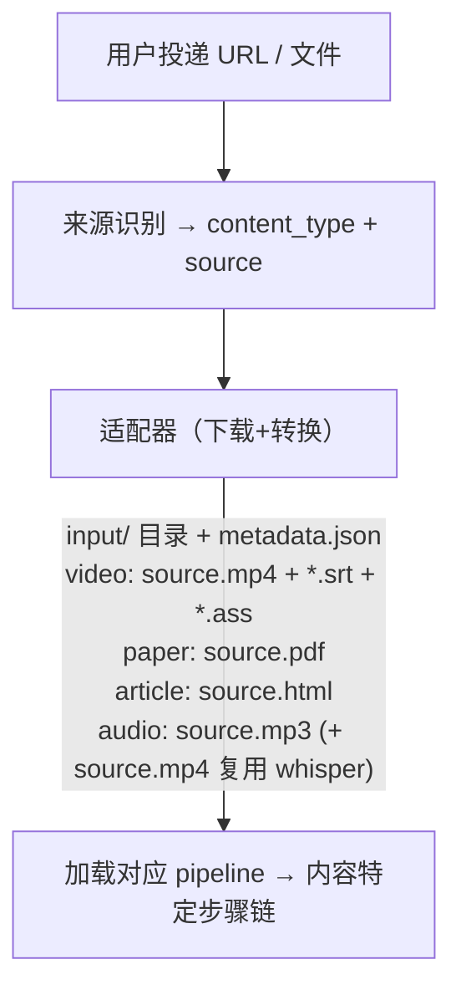

# 05 · 内容适配器

> 不同来源的内容如何接入系统。视频是 M1，论文是 M1，文章 + 音频/播客是 M6。

## 1. 适配器模型

每种内容来源对应一个适配器。适配器负责：下载原始内容 + 生成统一的 input/ 目录结构。



适配器是 `01_download` 步骤（`steps/common/step_01_download.py`）的内部实现——同一个步骤脚本，根据 content_type 和 source 选择不同的下载/转换逻辑。

## 2. 视频适配器（M1）

### B站

| 项目 | 值 |
|------|---|
| 识别 | URL 含 `bilibili.com` 或以 `BV` 开头 |
| 下载器 | yutto |
| 字幕 | AI 自动字幕（大部分视频有） |
| 弹幕 | ASS 格式 |
| Cookies | 扫码登录获取，1080P 需要 |
| 批量 | 支持 UP主 mid 批量导入 |

### YouTube

| 项目 | 值 |
|------|---|
| 识别 | URL 含 `youtube.com` 或 `youtu.be` |
| 下载器 | yt-dlp |
| 字幕 | CC 字幕 |
| 弹幕 | 无 |
| Cookies | 免费视频不需要，会员视频需手动上传 |

### 本地上传

| 项目 | 值 |
|------|---|
| 识别 | multipart 上传 |
| 字幕 | 可选上传 .srt，无则走 Whisper |
| 大小限制 | 2GB |

### 通用 URL

yt-dlp 支持的其他网站，作为兜底。

## 3. 论文适配器（M1 已实现）

```
输入: PDF 上传 或 arXiv URL
输出: input/source.pdf + input/metadata.json
```

arXiv URL 自动下载 PDF。本地 PDF 直接上传。

## 4. 文章适配器（M6 已实现）

```
输入: 网页 URL（公众号/博客/新闻）
输出: input/source.html + input/article_meta.json
```

用 trafilatura 提取正文（中文友好，纯 Python），保留图片引用；同时落一份正文/标题供后续解析步使用。

## 5. 音频 / 播客适配器（M6 已实现）

```
输入: 单集音频 URL 或音频文件上传（.mp3/.m4a/.wav/.aac）
输出: input/source.mp3 (+ input/source.mp4 复用 whisper) + input/metadata.json
```

只取单集音频，无 RSS 订阅（RSS 追更留 M4/Agent）。下载后复用 video 的 whisper 步转写（`02_whisper` 入参约定为 `source.mp4`，故同时落一份），再走 audio pipeline：`01_download → 02_whisper → 03_transcript_parse → 04_smart_podcast → 05_review`。

## 6. Cookies 管理

```
/data/cookies/
├── bilibili.txt      # B站 (扫码自动更新)
├── youtube.txt       # YouTube (手动上传)
└── status.json       # 各平台状态
```

```json
{
  "bilibili": {"valid": true, "updated": "2026-05-16", "quality": "1080P"},
  "youtube":  {"valid": false}
}
```

### Cookies 过期检测

下载步骤遇到 403/画质降级时自动检测：

```
01_download 执行 → 下载失败 (HTTP 403) 或 画质 < 预期
  → step meta 写入 {"cookies_expired": true, "platform": "bilibili"}
  → 发布 WebSocket 事件: {"event": "cookies_expired", "platform": "bilibili", "message": "B站 cookies 过期，请重新扫码"}
  → 前端弹窗提示用户扫码刷新
  → 用户扫码 → cookies 更新 → 重跑下载步骤
```

B站 cookies 有效期约 1-3 个月。YouTube cookies 有效期数月，较少过期。
