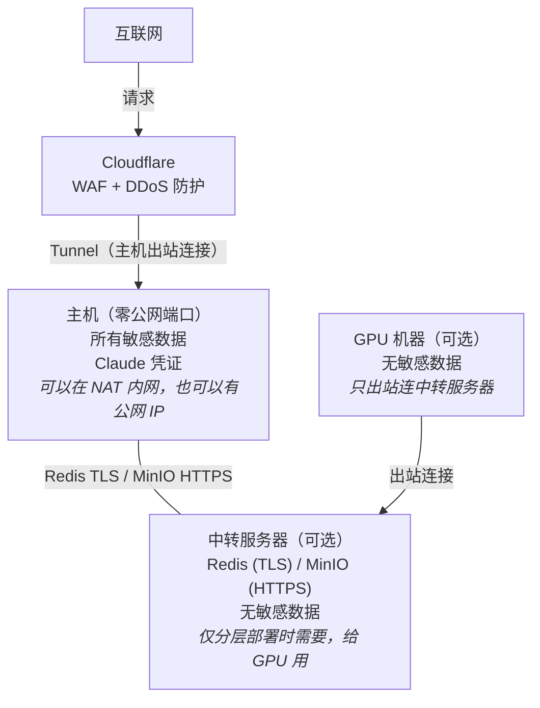

# 07 · 安全

> 核心原则：主机和 GPU 零公网端口。Cloudflare 是用户入口。中转服务器（可选）只给 GPU 传话，被攻破只影响 GPU 通信。

## 1. 攻击面



## 2. 各节点风险

### 主机 — 风险低

唯一外部入口是 Cloudflare Tunnel（主机出站建立）。如果主机有公网 IP，也只通过 Tunnel 暴露 API 端口。

| 威胁 | 风险 | 说明 |
|------|------|------|
| Cloudflare Tunnel 入口 | 低 | Cloudflare Access 认证 + API Bearer Token |
| Claude 凭证泄露 | 低 | 文件权限 600，只在主机本地 |

主机敏感数据清单：
- `~/.claude/` — Claude OAuth 凭证
- `/data/cookies/` — 视频平台 cookies
- `/data/jobs/` — 视频和笔记

### 中转服务器 — 风险中（被攻破损失低）

仅分层部署（有 GPU）时存在。

| 威胁 | 风险 | 防护 | 被攻破后果 |
|------|------|------|-----------|
| Redis 未授权访问 | 高 | 强密码 + TLS + 禁危险命令 | 能往队列塞垃圾任务 |
| MinIO 文件泄露 | 中 | access key + HTTPS + 24h TTL | 看到临时视频文件 |
| SSH 暴力破解 | 中 | key-only + 非标准端口 | 控制中转（但无敏感数据） |

**中转被攻破最坏情况**：
- ❌ 不会泄露 Claude 凭证（在主机）
- ❌ 不会泄露平台 cookies（在主机）
- ❌ 不会影响用户访问（走 Cloudflare，不经过中转）
- ⚠️ GPU Worker 断开（改 Redis 密码即可恢复）
- ⚠️ MinIO 临时文件泄露（24h 自动清理）

### GPU 机器 — 风险低

只出站连中转服务器。无敏感数据。Docker 容器隔离。

## 3. 认证体系

```
层级              认证方式                    保护对象
────────────────────────────────────────────────────────
Cloudflare       Access (邮箱/密码)           Web UI 入口
API              Bearer Token                 API 端点
Redis            requirepass + TLS            任务队列
MinIO            access_key + secret + HTTPS  文件存储
SSH              key-only (禁密码)            服务器管理
```

### Cloudflare Access

免费方案，支持邮箱验证码登录。用户首次访问输入邮箱 → 收到验证码 → 验证通过后设 cookie。

### API Bearer Token

即使 Cloudflare 被绕过（几乎不可能），API 仍需 Bearer Token。Token 只存在主机本地 `.env`。

> 限流 / 防爆破在边缘层(Cloudflare/Caddy Basic Auth)做,应用内不内置限流——
> API 默认零公网端口、仅绑本机(`API_BIND_IP`),verify_token 用常量时间比对。
> 直接把 API 端口暴露到公网时,务必同时设强随机 `API_TOKEN` 并在边缘加限流。

## 4. 通信安全

| 链路 | 协议 | 加密 | 认证 |
|------|------|------|------|
| 用户 → Cloudflare | HTTPS | TLS 1.3 | Access |
| Cloudflare → 主机 | Tunnel | Cloudflare 加密 | Tunnel Token |
| 主机 → 中转 Redis | Redis TLS | TLS 1.2+ | requirepass |
| 主机 → 中转 MinIO | HTTPS | TLS 1.3 | access key |
| GPU → 中转 Redis | Redis TLS | TLS 1.2+ | requirepass |
| GPU → 中转 MinIO | HTTPS | TLS 1.3 | access key |
| 主机 → Claude API | HTTPS | TLS 1.3 | OAuth |

## 5. 任务注入防护

攻击者拿到 Redis 密码后能塞恶意任务：

```python
def validate_job_id(job_id: str) -> bool:
    return bool(re.match(r'^[a-zA-Z0-9_-]{1,100}$', job_id))

def validate_step(step: str) -> bool:
    return step in VALID_STEPS  # 白名单

def validate_url(url: str) -> bool:
    if not url.startswith(("http://", "https://")):
        return False
    host = urlparse(url).hostname or ""
    return not any(host.startswith(b) for b in ["127.", "localhost", "10.", "192.168.", "172.16."])
```

Worker 执行前校验 job_id + step + url，不合法直接丢弃。

## 6. 密钥管理

| 密钥 | 存储位置 | 谁需要 |
|------|---------|--------|
| API Bearer Token | 主机 .env | API 服务 |
| Redis 密码 | 中转 .env + 主机 .env + GPU .env | 所有连 Redis 的组件 |
| MinIO access key | 中转 .env + 主机 .env + GPU .env | 调度器 + GPU Worker |
| Cloudflare Tunnel Token | 主机 .env | cloudflared |
| Claude OAuth | 主机 ~/.claude/ | Claude Worker |
| 平台 cookies | 主机 /data/cookies/ | Download Worker |

**原则**：Claude 凭证和平台 cookies 只在主机，不传到中转/GPU。

## 7. 应急预案

### 中转服务器被攻破

```
1. 改 Redis 密码 + MinIO 密钥（阻断所有连接）
2. 重建中转服务器（重装系统，5 分钟）
3. 用新密码更新主机和 GPU 的 .env
4. 重启主机和 GPU Worker
```

恢复时间：30 分钟。数据损失：零（全在主机）。用户访问不中断（走 Cloudflare）。

### 主机磁盘故障

定期备份 `/data/` 和 `/db/`。RAID 或 ZFS 快照做第一层保护。

## 8. 安全检查清单

```yaml
中转服务器 (如有):
  - [ ] SSH key-only + 非标准端口
  - [ ] 防火墙只开 Redis TLS 端口 + MinIO HTTPS 端口
  - [ ] Redis: requirepass + TLS + 禁 CONFIG/EVAL/SCRIPT
  - [ ] MinIO: 强密码 + HTTPS + bucket 级 policy
  - [ ] 自动安全更新

主机:
  - [ ] Cloudflare Tunnel 连接正常
  - [ ] API Bearer Token 认证
  - [ ] Claude 凭证权限 600
  - [ ] cookies 权限 600
  - [ ] Docker no-new-privileges
  - [ ] 定期备份

GPU (如有):
  - [ ] Redis 密码通过环境变量（不写文件）
  - [ ] Docker --read-only + 内存限制
```
